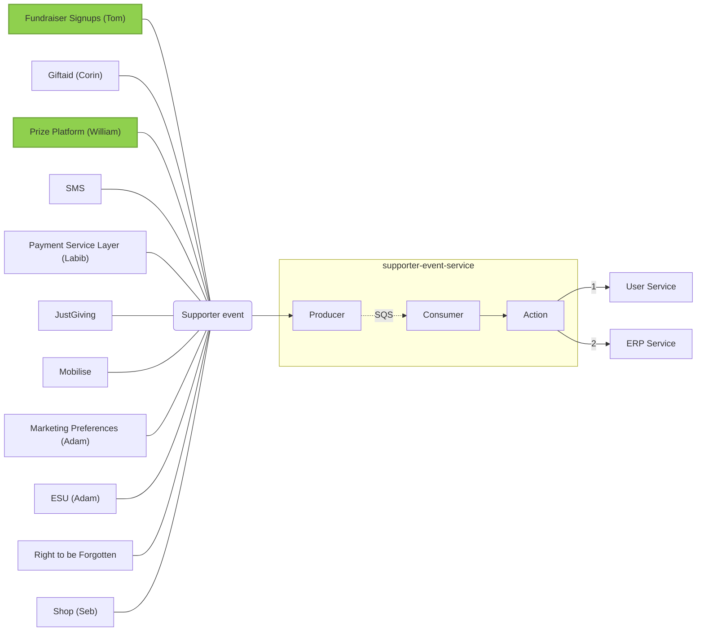

# Architecture
***

While we prefer in-code and live documentation over wiki pages, these are best suited to single services and we don't have a place to document broader processes that involve the interaction of several services. This section aims to provide that overview of how various services fit together.

## Supporter Events Service

The service aims to propagate supporter data to User Service and supporter events to ERP Service.

User Service and ERP Service exist on one region only because of their structure; should they be unavailable for any reason, propagation of data from upstream services may be interrupted. Supporter Events is a multi-region service designed to handle incoming traffic from all sources. Events are queued to SQS and processed one by one.

When identities are supplied to the `user-service` section of the payload, Supporter Events returns a salted hash of the identity that can be used by upstream services to identity resources, so that anonymisation won't break relationships between data and services.

Supporter Service is supposed to handle only write requests to User Service and ERP Service. If an upstream service requires data stored in either service, it should either:

- **For critical paths**: store a copy of the data in the service itself
- **For non-critical paths**: gracefully handle request failures

Every service should be able to operate independently from User Service and ERP Service for all the critical paths; when a path is deemed non critical (i.e. it is acceptable to present a failure to an end user), User Service and ERP Service can be queued directly.

While User Service and ERP Service are unlikely to be unavailable, under no circumstances a critical path upstream should depend on either, for read or writes, as they are not multiregional services.

### Supporter data flow

