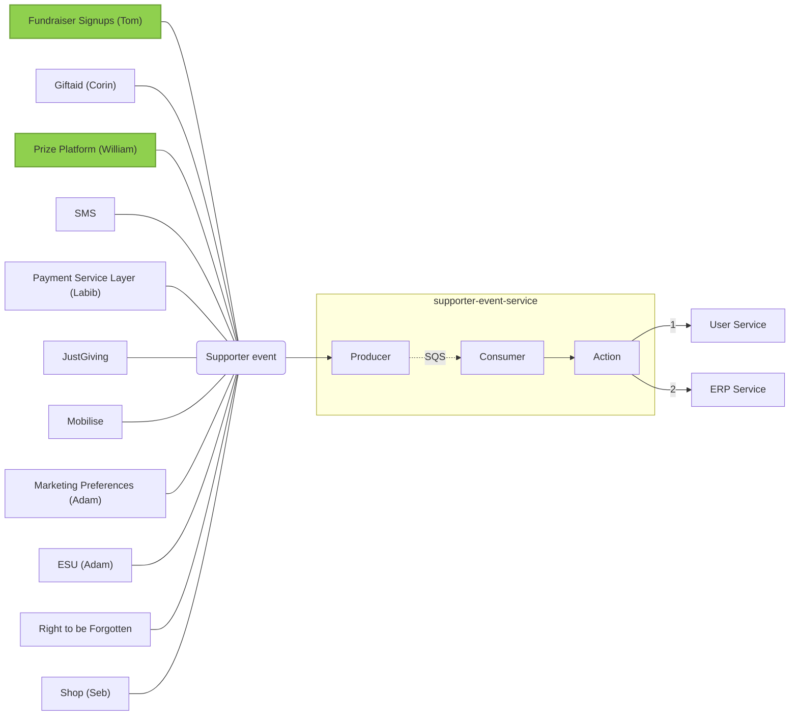

# Architecture
***

While we prefer in-code and live documentation over wiki pages, these are best suited to single services and we don't have a place to document broader processes that involve the interaction of several services. This section aims to provide that overview of how various services fit together.

## Supporter data flow

