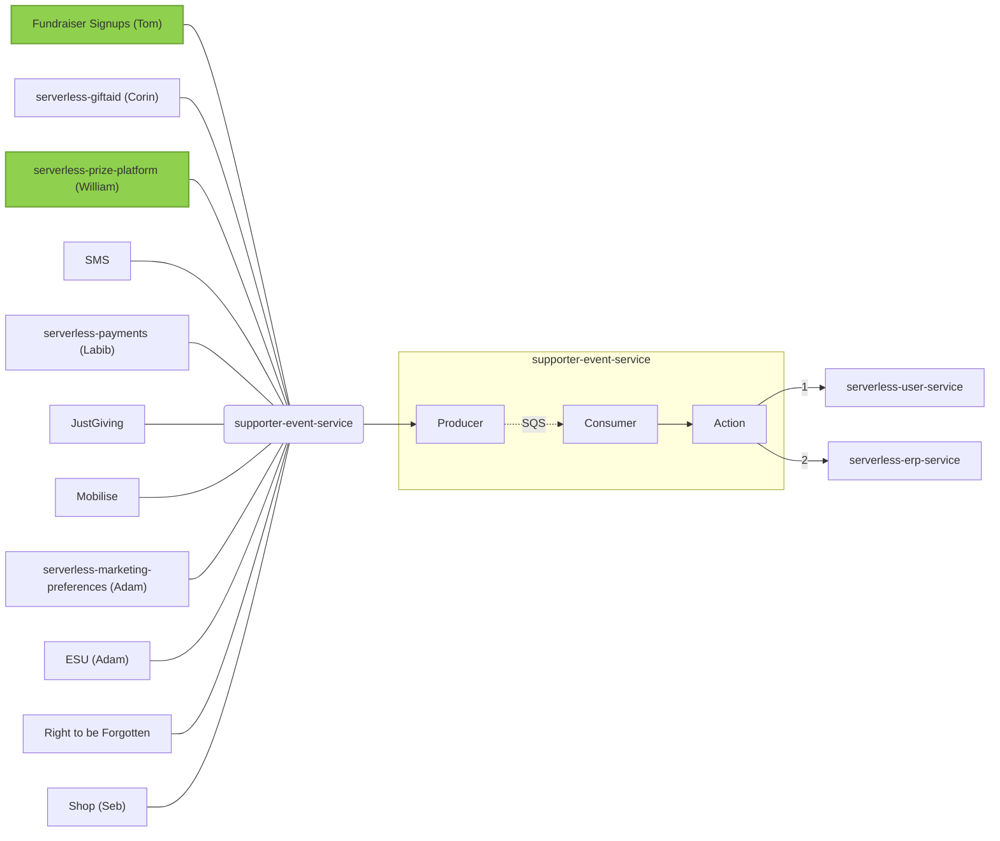

# Architecture
***

While we prefer in-code and live documentation over wiki pages, these are best suited to single services and we don't have a place to document broader processes that involve the interaction of several services. This section aims to provide that overview of how various services fit together.

## `supporter-event-service`

The service aims to propagate [supporter identities](https://github.com/comicrelief/data-models/tree/master/src/schemas/user-service/models/requests) to `serverless-user-service` and [supporter events](https://github.com/comicrelief/data-models/tree/master/src/schemas/erp/models/actions) to `serverless-erp-service`.

`serverless-user-service` and `serverless-erp-service` exist on one region only because of their structure; should they be unavailable for any reason, propagation of data from upstream services may be interrupted. `supporter-event-service` is a multi-region service designed to handle incoming traffic from all sources. Events are queued to SQS and processed one by one.

When identities are supplied to the `serverless-user-service` section of the payload, `supporter-event-service` returns a salted hash of the identity that can be used by upstream services to identity resources, so that anonymisation won't break relationships between data and services.

`supporter-event-service` is supposed to handle only write requests to `serverless-user-service` and `serverless-erp-service`. If an upstream service requires data stored in either service, it should either:

- **For critical paths**: store a copy of the data in the service itself
- **For non-critical paths**: gracefully handle request failures

A **critical path** is one where it is not acceptable to present a failure to an end user.

Every service should be able to operate independently from `serverless-user-service` and `serverless-erp-service` for all the critical paths; if a path is deemed non-critical, the services can and should be queried directly.

While `serverless-user-service` and `serverless-erp-service` are unlikely to be unavailable, under no circumstances should a critical path upstream depend on either, for read or for writes, as they are not multiregional services.

### Supporter data flow

